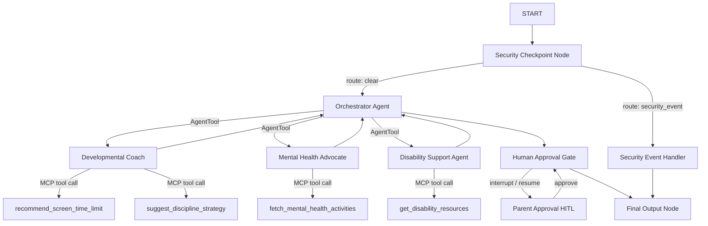

# Parent-Pilot — Secure Multi-Agent Parenting Companion

An AI-driven assistant utilizing the Google ADK 2.0 Workflow API and Model Context Protocol (MCP) to provide parents with age-appropriate tips, kids' mental health support, screen-time balance limits, moral disciplining strategies, and specialized neurodiversity/disability resources.

## Prerequisites

Before starting, ensure you have:
- Python 3.11 or higher
- **uv**: Python package manager - [Install uv](https://docs.astral.sh/uv/getting-started/installation/)
- **Gemini API Key**: From [Google AI Studio](https://aistudio.google.com/apikey)

## Quick Start

1. Clone this repository:
   ```bash
   git clone <repo-url>
   cd parent-pilot
   ```

2. Copy the environment template and set your API key:
   ```bash
   cp .env.example .env
   # Edit .env and replace <paste_your_key_here> with your Gemini API Key
   ```

3. Install project dependencies:
   ```bash
   make install
   ```

4. Launch the local dev playground:
   ```bash
   make playground
   ```
   This will open the interactive Dev UI in your browser at [http://localhost:18081](http://localhost:18081).

## Architecture



## How To Run

- **`make playground`**: Runs the interactive developer playground UI at [http://localhost:18081](http://localhost:18081).
- **`make run`**: Runs the agent as a local FastAPI web server at [http://127.0.0.1:8000](http://127.0.0.1:8000).
- **`make install`**: Installs package dependencies into the local `.venv` using `uv sync`.
- **`make test`**: Runs unit and integration tests.

## Sample Test Cases

### Test Case 1: Age-Appropriate Screen Time recommendation
- **Input**: `"What is the recommended screen time limit for my 5 year old child?"`
- **Expected Flow**:
  - The `security_checkpoint` passes the query as `"clear"`.
  - The `orchestrator_agent` delegates to the `developmental_coach`.
  - The `developmental_coach` calls the MCP tool `recommend_screen_time_limit` with `age=5`.
  - The response is routed to the `human_approval_gate` which halts and asks the parent for approval.
- **Check**: You will see a `parent_confirm` pause prompt in the playground. Type `"approve"` to proceed. The output will display: `"Approved by Parent. Implementing parenting recommendations: ... Max 1 hour per day..."`

### Test Case 2: Special Needs IEP Guidance
- **Input**: `"My 9-year-old child has ADHD. I need tips for homework routines and some support resources."`
- **Expected Flow**:
  - The `security_checkpoint` passes the query as `"clear"`.
  - The `orchestrator_agent` delegates to the `disability_support_agent`.
  - The `disability_support_agent` calls the MCP tool `get_disability_resources` with `category="adhd"`.
- **Check**: The agent outputs ADHD-specific educational tips (checklists, routines) and links to websites like CHADD and Understood.org.

### Test Case 3: PII Redaction
- **Input**: `"Hi, my name is John. My phone is 123-456-7890 and email is john@example.com. Can you suggest positive discipline for my 7 year old child?"`
- **Expected Flow**:
  - The `security_checkpoint` node intercepts the query and scrubs the phone number and email to `[PHONE_REDACTED]` and `[EMAIL_REDACTED]`.
  - The cleaned query is routed to `orchestrator_agent` -> `developmental_coach` -> MCP tool `suggest_discipline_strategy`.
- **Check**: Look at the terminal logs running the playground: a JSON log entry starting with `[AUDIT LOG]` will show `"pii_redacted": true`. The final response will address the behavioral question without displaying your phone or email.

## Assets

- [Architecture Diagram](file:///Users/magizh/Documents/2026/ADK-Workspace/parent-pilot/assets/architecture_diagram.png) (Workflow and node routing)
- [Cover Banner](file:///Users/magizh/Documents/2026/ADK-Workspace/parent-pilot/assets/cover_page_banner.png) (Project cover asset)

## Demo Script

A complete 3-4 minute presentation narration script is available at [DEMO_SCRIPT.txt](file:///Users/magizh/Documents/2026/ADK-Workspace/parent-pilot/DEMO_SCRIPT.txt).

## Push to GitHub

1. Create a new repo at https://github.com/new
   - Name: `parent-pilot`
   - Visibility: Public or Private
   - Do NOT initialize with README (you already have one)

2. In your terminal, navigate into your project folder:
   ```bash
   cd parent-pilot
   git init
   git add .
   git commit -m "Initial commit: parent-pilot ADK agent"
   git branch -M main
   git remote add origin https://github.com/<your-username>/parent-pilot.git
   git push -u origin main
   ```

3. Verify `.gitignore` includes:
   ```
   .env          ← your API key — must NEVER be pushed
   .venv/
   __pycache__/
   *.pyc
   .adk/
   ```

⚠️ **NEVER push `.env` to GitHub. Your API key will be exposed publicly.**

## Troubleshooting

1. **404 Model Not Found Error**:
   Ensure `GEMINI_MODEL=gemini-2.5-flash` (or `-lite`) is set in your `.env`. The older `gemini-1.5-*` models are retired and return 404.
2. **Missing MCP Server Dependencies**:
   If the playground starts but tools fail, make sure you ran `make install` or `uv sync` to ensure the `mcp` and `fastmcp` SDK packages are in the active environment.
3. **No Agents Found Error**:
   If `make playground` fails, ensure you run it from the root of `parent-pilot/` where `Makefile` and `app/` are located, and verify `agents-cli-manifest.yaml` points to `agent_directory: "app"`.
