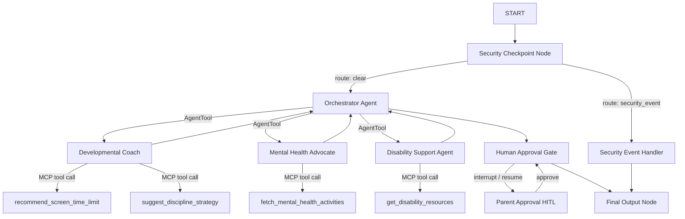

# Submission Write-Up: parent-pilot

## Problem Statement
Parenting in the digital age presents complex, highly personalized challenges. Parents often struggle to balance screen time, support neurodivergent children (e.g., ADHD/Autism IEPs), navigate emotional/mental health challenges, and enforce behavioral discipline. While generic search engines yield cluttered, conflicting results, a dedicated AI system must be:
1. **Age-Aware**: Suggestions must change radically based on child age.
2. **Secure**: Protecting sensitive child/parent details (PII) is mandatory.
3. **Safe**: Must block inappropriate queries and disclaim clinical medical/diagnostic claims.
4. **Verified**: Incorporate Human-in-the-loop (HITL) for schedule or house rules.

`parent-pilot` solves these problems by structuring collaboration between specialized AI agents via a secure workflow graph.

## Solution Architecture

## Concepts Used

- **ADK 2.0 Workflow Graph API**: Built the entire flow deterministically via `Workflow(edges=[...])` in [agent.py](file:///Users/magizh/Documents/2026/ADK-Workspace/parent-pilot/app/agent.py#L198-L209).
- **LlmAgent**: Used for our four intelligent entities: `orchestrator_agent`, `developmental_coach`, `mental_health_advocate`, and `disability_support_agent` in [agent.py](file:///Users/magizh/Documents/2026/ADK-Workspace/parent-pilot/app/agent.py#L23-L84).
- **AgentTool**: Embedded in the orchestrator to delegate sub-tasks dynamically to specific specialists in [agent.py](file:///Users/magizh/Documents/2026/ADK-Workspace/parent-pilot/app/agent.py#L79-L83).
- **MCP Server**: Designed a local stdio connection in [mcp_server.py](file:///Users/magizh/Documents/2026/ADK-Workspace/parent-pilot/app/mcp_server.py) and registered it under [agent.py](file:///Users/magizh/Documents/2026/ADK-Workspace/parent-pilot/app/agent.py#L38-L63).
- **Security Checkpoint**: Implemented custom PII, injection filtering, and JSON logging in [agent.py](file:///Users/magizh/Documents/2026/ADK-Workspace/parent-pilot/app/agent.py#L90-L150).
- **Agents CLI**: Scaffolded structure, package management, and playground launching.

## Security Design

1. **PII Scrubbing**: Cleans email addresses and phone numbers using regex prior to sending data to LLM endpoints. This ensures children's and parents' confidential contact details are never leaked.
2. **Prompt Injection / Abuse Filter**: Checks for common jailbreak keywords and physical abuse behavior, routing them immediately to a blocked `security_event` route.
3. **Structured JSON Audit Logs**: Every query prints an audit entry indicating status, redact actions, and severity levels. This enables easy integration with log parsers (e.g., Google Cloud Logging).
4. **Domain Medical Guardrail**: Flags queries asking for drug prescriptions or clinical medical diagnoses, redirecting the user to licensed professional care.

## MCP Server Design

Our server exposes four domain-specific parenting tools:
- `recommend_screen_time_limit`: Provides age-dependent daily limits (hours) and screen practices.
- `suggest_discipline_strategy`: Recommends moral-focused developmental correction methods.
- `get_disability_resources`: Links to special needs advocacy and school IEP accommodations.
- `fetch_mental_health_activities`: Offers grounding, anxiety-relief, and mindfulness exercises.

## Human-in-the-Loop (HITL) Flow

If the final suggested advice involves child scheduling (screen time limits) or discipline correction (rules), the system prompts a `RequestInput` block. This forces the parent to review the AI recommendations and type `"approve"` in the interface. This ensures AI suggestions are never autonomously actioned on kids without parental consent.

## Demo Walkthrough

- **Scenario 1**: Requesting screen time advice for a 5-year-old child triggering the Parental Gateway approval loop.
- **Scenario 2**: Fetching specialized resources (such as under Wrightslaw or CHADD) for a 9-year-old child struggling with ADHD homework routine.
- **Scenario 3**: Checking scrubbing logs when typing child's private details.

## Impact & Value Statement

`parent-pilot` bridges the gap between scattered web recommendations and parents who need immediate, context-specific, and safe advice. By focusing heavily on safety checkpoints and keeping parents in control of schedules, it acts as a trusted companion for general development, neurodiversity guidance, and children's emotional well-being.
